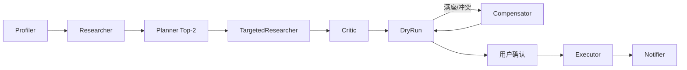

# 周末闲时活动规划 Agent · 设计文档

> 赛题 06 交付：Planning 策略 + 工具链路 + 异常处理（≤2 页）

---

## 1. 定位与 Planning 策略

**定位**：本地 4–6 小时 **规划 + 执行** Agent（Task-Completion）。输入一句自然语言 → Top-2 可执行方案 → HIL 确认 → 订位/购票/送餐 → 行程卡。

| 场景 | 典型约束 | 规划侧重 |
|------|----------|----------|
| **家庭** | 亲子 + 控糖控卡档案 | 儿童乐园/公园 + 午饭锚点；档案 vs 火锅 HIL |
| **朋友** | 4 人 + 重口味社交 | 剧本杀/活动 + 烤肉；禁辣档案 vs 重口味 |

| 模块 | 策略 |
|------|------|
| **Profiler** | 规则画像（场景/人数/时间/菜系/点名店）；`inject_history_archives` 注入跨端健康档案 Mock |
| **Researcher** | Mock POI 初搜 + 五维打分（偏好/历史/评分/距离/预算）；严苛池不足时内存退避 |
| **Planner** | 硬过滤（亲子/菜系/距离）+ 玩→吃排程；Top-2 差异化；顺路加餐精准搜 |
| **Critic** | 规则校验 + HIL 可选附加项（不静默插入阶段） |
| **DryRun / Executor** | 读工具预检（≤3s 并行）→ 用户确认后写工具落单 |
| **Compensator** | 满座 NO_SEAT / 无票 / 时间冲突：公式选替补、拉黑 POI、同步备选方案 |

**显式优先**：用户点名店名、火锅/烤肉等重口味，覆盖档案里的低卡/禁辣；冲突时黄条 + HIL 点改，不静默替用户决定。

---

## 2. 工具调用链路

经 `backend.tools.registry.invoke` 调 Mock 美团 HTTP；**读=预检，写=落单**；`idempotency_key` 幂等。

| 阶段 | DryRun（读） | Executor（写） |
|------|--------------|----------------|
| 玩 | `check_activity_availability` | `buy_ticket` |
| 吃 | `check_table_availability` | `book_table` |
| 附加 | — | `order_addon`（绑定玩/吃 POI 出口） |

主流程：`POST /v1/agent/stream` 规划至预检 → SSE Trace → 前端展示方案 → `confirm` 下单。端点详见 `docs/mock-api.md`。

**HIL 能力**：`replan` 改偏好重搜；`plan/revise` 微调换店/换活动；确认前对所选方案重新预检 + Compensator 自愈。

---

## 3. 异常处理

| 异常 | 检测 | 处理 |
|------|------|------|
| **满座 409** | DryRun `check_table_availability` FAIL | Compensator 公式换店、拉黑 POI、主备方案同步改订；Trace 可见 Recovery |
| **无票 410** | 活动库存 FAIL | 换同阶段备选 POI |
| **时间冲突** | 行程超窗 | 贪心压缩非核心时段 |
| **偏好矛盾** | 档案低卡 vs 用户火锅 | `issueKind=needs_preference_fix`，删标签后 replan |
| **距离/菜系做不到** | HIL 设 5km+日料 | 严格距离过滤；范围内无日料则妥协提示，不静默越界 |
| **幂等** | 重复 confirm | 同 `idempotency_key` 返回原单 |

原则：**能自愈则换店并写进黄条；需人取舍则 HIL，不静默推店。**

---

## 4. 推荐演示（2 分钟）

| 场景 | 输入/操作 | 看点 |
|------|-----------|------|
| **朋友（主推）** | 4 人重口味聚餐 | Trace：禁辣档案 Mock；姜虎东 4 人满座 → Recovery 换店 |
| **家庭** | 早上出游 + 中午川一哥火锅 | 点名店优先；`poi_003` 午市满座 → 两卡同步改海底捞 |
| **中途变卦** | 面板改「日料·5km」或微调换餐厅 | 清旧拉黑/店名；严格 5km；满座走 Compensator 不弹裸 409 |

CLI：`python -m backend.demo --scene friends` / `--scene family`；`python app.py` 打开答辩 UI。

**已实现**：LangGraph 状态机、Mock 美团、Top-2、SSE Trace、HIL、补偿重规划、73 项 pytest；亮点回归见 `python scripts/demo_highlights.py`。  
**未做**：真美团 API、支付、向量库量产。

**展望（Zero-Skill）**：跨端买药/外卖行为 → 隐式画像沉淀 → Planner 消费有效约束；执行层（DryRun/Executor/Compensator）可复用。当前用 `inject_history_archives` Mock 该切口。
