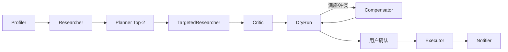

# 周末闲时活动规划 Agent · 设计文档

> 赛题 06 交付：Planning 策略 + 工具链路 + 异常处理（≤2 页）  
> **演示**：`python app.py` → http://127.0.0.1:8000　**亲测案例**：见 [`README.md`](README.md)

---

## 1. 定位与 Planning 策略

**定位**：赛题 **执行型 Agent**——4–6 小时 **玩 → 吃 → 附加**，预检空位/库存，用户确认后代订。自然语言 → Top-2 方案 → HIL → 落单 → 行程卡。

| 赛题场景 | 约束 | 规划侧重 |
|----------|------|----------|
| **家庭** | 5 岁娃 + 控卡/轻食 | 亲子玩 + 午饭锚点；档案 vs 火锅 → 黄条 |
| **朋友** | 4 人 + 重口味 | 活动 + 烤肉；档案禁辣 vs 显式重口味 |

| 模块 | 策略 |
|------|------|
| **Profiler** | 场景/人数/时间/菜系/点名店；`inject_history_archives` Mock 跨端档案 |
| **Researcher** | POI 初搜 + 五维打分；池不足则内存退避 |
| **Planner** | 硬过滤 + 玩→吃排程；Top-2 差异化 + 方案全局分 |
| **Critic** | 规则校验；附加仅 HIL 勾选 |
| **DryRun / Executor** | 并行预检（≤3s）→ 确认后落单 |
| **Compensator** | 满座/无票/冲突：公式换替补、拉黑、主备同步 |

**显式优先**：点名店、火锅/烤肉覆盖档案低卡/禁辣；做不到则黄条 + replan。

### 打分公式（Trace 中 `算式·` 与本文一致）

**POI 五维分**（Researcher，$p,h,r,d,b \in [0,1]$）：

$$
S_{\mathrm{poi}} = 0.35\,p + 0.20\,h + 0.20\,r + 0.15\,d + 0.10\,b
$$

| 维度 | 含义 |
|------|------|
| $p$ | 偏好：标签/菜系/场景匹配画像 |
| $h$ | 历史：跨端权重命中（无历史取 $0.5$） |
| $r$ | 平台评分（Mock 归一化） |
| $d$ | 距离 Sigmoid：$d = \bigl(1 + e^{\,2(d_{\mathrm{km}} - d_{\mathrm{limit}})}\bigr)^{-1}$（超距降分不砍店） |
| $b$ | 预算（仅「吃」）：$\bar{p} \le B \Rightarrow b{=}1$；否则 $b = e^{-5(\bar{p}-B)/B}$ |

**方案全局分**（Planner，$\lambda{=}0.4$，$\alpha{=}0.5$，顺路阈值 $3\,\mathrm{km}$）：

$$
\bar{s} = \tfrac{1}{2}\bigl(S_{\mathrm{play}} + S_{\mathrm{eat}}\bigr),\quad
\Delta = \bigl|d_{\mathrm{play}} - d_{\mathrm{eat}}\bigr|
$$

$$
P_{\mathrm{route}} = 1 - \exp\!\bigl(-\alpha \cdot \max(0,\; \Delta - 3)\bigr),\quad
S_{\mathrm{plan}} = \bar{s}\,\bigl(1 - \lambda \cdot P_{\mathrm{route}}\bigr)
$$

**退避与妥协**：初池 20 家；严苛不足时内存放宽 $d_{\mathrm{limit}}{+}3\,\mathrm{km}$、$B{\times}1.3$ 重排；硬过滤仍空则取 $S_{\mathrm{poi}}$ 最高并置 `is_compromised`（前端黄条）。

Web 入口：主界面方案卡；右下角 **Trace** 全屏展示算式与 Recovery 过程。

---

## 2. 工具调用链路

`backend.tools.registry.invoke` → Mock 美团 HTTP；**读=预检，写=落单**；`idempotency_key` 幂等。

| 阶段 | DryRun | Executor |
|------|--------|----------|
| 玩 | `check_activity_availability` | `buy_ticket` |
| 吃 | `check_table_availability` | `book_table` |
| 附加 | — | `order_addon`（绑玩/吃出口） |

`stream` 规划至预检 → SSE Trace → `confirm` 下单。HIL：`replan` / `plan/revise`（品牌排除 + 总价刷新）。

---

## 3. 异常处理

| 异常 | 检测 | 处理 |
|------|------|------|
| **满座 409** | 订座 FAIL | Compensator 换店、拉黑、主备同步 |
| **无票 410** | 库存 FAIL | 同阶段备选 POI |
| **时间冲突** | 超窗 | 贪心压缩，餐段 ≥30min |
| **偏好矛盾** | 低卡 vs 火锅 | `needs_preference_fix` → replan |
| **距离/菜系** | 5km+日料 | 严格过滤；无匹配则黄条 |
| **幂等** | 重复 confirm | 同 key 返原单 |

原则：**能自愈则换店写黄条；需人取舍则 HIL。**

---

**已实现**：LangGraph、Mock（有状态满座）、Web+Trace、Top-2、HIL、Compensator、73 pytest（`scripts/demo_highlights.py`）。  
**未做**：真 API、支付。　**展望**：跨端行为 → 隐式画像；执行层可复用。
