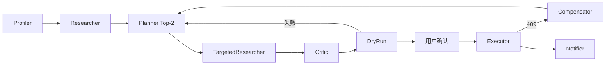

# 周末闲时活动规划 Agent · 设计文档

> 赛题 06 交付物：Planning 策略 + 工具链路 + 异常处理（≤2 页）。完整叙事见 `docs/解释文档.md`。

---

## 1. 系统定位与 Planning 策略

**定位**：本地 4–6 小时 **规划 + 执行** Agent（Task-Completion，非搜索推荐）。输入一句自然语言 → Top-2 方案 → HIL 确认 → 自动订位/购票/送餐。

| 场景 | 约束 | 规划侧重 |
|------|------|----------|
| **家庭** | 5 岁娃 + 老婆减肥/低卡 | 控糖控卡档案 vs 火锅/重口味；离园饮品 HIL 可勾选 |
| **朋友** | 4 人 + 重口味社交 | 恢复期禁辣档案 vs 重口味；4 人桌预检；餐前鲜花 HIL 可勾选 |

| 角色 | 策略要点 |
|------|----------|
| Profiler | 规则画像 + **历史档案 Mock**（跨端健康约束注入） |
| Researcher / Planner | 硬过滤 + 可解释打分；`blocked` POI 换备选 |
| Executor | 仅确认后写操作；附加项 `selected_addon_ids` |

---

## 2. 工具调用链路

经 `registry.invoke` 调 Mock 美团 HTTP；**读=预检，写=落单**；`idempotency_key` 幂等。

| 阶段 | DryRun（读） | Executor（写） |
|------|--------------|----------------|
| 玩 | `check_activity_availability` | `buy_ticket` |
| 吃 | `check_table_availability` | `book_table` |
| 附加 | — | `order_addon`（绑定各方案 POI） |

流程：`plan_to_dry_run_calls` → 全 OK → **HIL 暂停** → `confirm` → 写操作 + 勾选附加 → 行程卡。端点见 `docs/mock-api.md`。

---

## 3. 异常处理机制

| 异常 | 策略 | Demo |
|------|------|------|
| 预检满座 | DryRun FAIL → Planner 拉黑 POI 换店 | 朋友 4 人 @ 姜虎东 → 炙烤大叔 |
| 下单 409 | Compensator 回滚 → 重规划 | `demo --fail 吃` |
| **隐式 vs 显式偏好** | 历史档案注入约束；HIL 黄条，不静默推店 | 家庭：低卡档案 vs 火锅；朋友：禁辣档案 vs 重口味 |
| 幂等重复确认 | 同 key 返回原单 | 防双击 |

原则：Trace SSE 可复盘；能自愈则换店，需人取舍则 HIL。

---

## 4. Demo 叙事

启动：`python app.py` → 左 UI + 右 Trace。**建议主秀朋友场景**：

1. 右侧 Trace：`Zero-Skill·隐式画像(Mock) | 痔疮恢复期…禁辣`
2. 左侧：「禁辣·档案」标签 + 黄条矛盾
3. 续看满座 Recovery → 确认下单

家庭场景演示低卡档案 + 火锅冲突。完整叙事：`docs/解释文档.md`。

**范围内**：Mock、Top-2、HIL、补偿重规划。**范围外**：真 API、支付、向量库量产。

---

## 5. 展望：Zero-Skill 隐式画像（未来工作 · 书面交付）

**问题**：用户不会每次说「我痔疮恢复期要禁辣」；但美团系 **买药/外卖/到店** 能推断健康隐式约束。

**本 Demo（Mock）**：`inject_history_archives` 在朋友 4 人局注入禁辣 + 禁忌辣度，Trace/左栏黄条可观测；**不等于已接 LTM**。

**量产路径**：跨端行为 → 隐式画像沉淀 → 异步反思 Agent 更新约束 → **Planner 只消费有效画像**；DryRun / Executor / Compensator **不变**。

更多实现解释、演示叙事与未来路线见 `docs/解释文档.md`。
