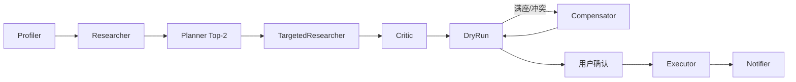

# 周末闲时活动规划 Agent · 设计文档

> 赛题 06 交付：Planning 策略 + 工具链路 + 异常处理（≤2 页）  
> **演示入口**：`python app.py` → http://127.0.0.1:8000（Web + Trace）；详细操作见 [`README.md`](README.md)

---

## 1. 定位与 Planning 策略

**定位**：赛题要求的 **执行型 Agent**——4–6 小时本地 **玩 → 吃 → 附加**，预检空位/库存后，用户确认再代订。输入一句自然语言 → **Top-2 可执行方案** → HIL → 落单 → 行程卡。

| 赛题场景 | 典型约束 | 规划侧重 |
|----------|----------|----------|
| **家庭** | 5 岁娃 + 老婆控卡/轻食 | 亲子玩 + 午饭锚点；档案 vs 用户火锅 → HIL 黄条 |
| **朋友** | 4 人社交 + 重口味 | 剧本杀/活动 + 烤肉；档案禁辣 vs 显式重口味 |

| 模块 | 策略 |
|------|------|
| **Profiler** | 规则画像（场景/人数/时间/菜系/点名店）；`inject_history_archives` Mock 跨端健康档案 |
| **Researcher** | Mock POI 初搜 + **五维打分**（偏好35/历史20/评分20/距离15/预算10）；严苛池不足时内存退避 |
| **Planner** | 硬过滤 + 玩→吃排程；Top-2 差异化；**方案全局分**含顺路惩罚 λ=0.4 |
| **Critic** | 规则校验；附加项仅 HIL 勾选，不静默插入 |
| **DryRun / Executor** | 读工具并行预检（≤3s）→ 确认后写工具落单 |
| **Compensator** | NO_SEAT / NO_TICKET / CONFLICT：公式选替补、拉黑 POI、**主备方案同步** |

**显式优先**：点名店、火锅/烤肉等覆盖档案低卡/禁辣；做不到则黄条 + replan，不静默换店。

### Web 展示与 Trace 打分（透明决策）

主界面展示方案卡；右下角 **Trace** 按钮进入全屏 Trace（SSE 流式追加）。打分写入 Trace，前端解析 `算式·` 行并置顶图例：

| Trace 类型 | 含义 |
|----------|------|
| `算式·POI` | 单店五维加权：`总分 = Σ(权重×维度分)`，附距离/预算备注 |
| `算式·方案` | 组合分 = 玩吃均分 × (1 − 0.4×顺路惩罚)，gap>3km 惩罚递增 |
| `严苛·` / `退避·` | 候选池不足：内存放宽距离+3km、预算+30% 重排 |
| `妥协·` | 硬过滤仍无匹配 → `is_compromised` + 前端黄条 |
| `Recovery` / `DryRun` | 预检 FAIL → Compensator 换店 → 再预检 |

评委无需看代码即可审计「为何选这家店、为何换店」。

---

## 2. 工具调用链路

经 `backend.tools.registry.invoke` 调 Mock 美团 HTTP；**读=预检，写=落单**；`idempotency_key` 幂等。

| 阶段 | DryRun（读） | Executor（写） |
|------|--------------|----------------|
| 玩 | `check_activity_availability` | `buy_ticket` |
| 吃 | `check_table_availability` | `book_table` |
| 附加 | — | `order_addon`（`deliver_to_poi_id` 绑玩/吃出口） |

`POST /v1/agent/stream` 规划至预检 → SSE Trace → 前端展示 → `confirm` 下单。  
**HIL**：`replan` 改偏好；`plan/revise` 微调换店（品牌级排除 + 总价刷新）；确认前重预检 + Compensator。

---

## 3. 异常处理

| 异常 | 检测 | 处理 |
|------|------|------|
| **满座 409** | `check_table_availability` FAIL | Compensator 换店、拉黑、**主备同步**；Trace Recovery |
| **无票 410** | 活动库存 FAIL | 同阶段备选 POI |
| **时间冲突** | 行程超窗 | 贪心压缩，核心餐段 ≥30min |
| **偏好矛盾** | 档案低卡 vs 用户火锅 | `needs_preference_fix`，删标签后 replan |
| **距离/菜系做不到** | HIL 5km+日料 | 严格过滤；无匹配则妥协提示 |
| **幂等** | 重复 confirm | 同 key 返回原单 |

原则：**能自愈则换店并写黄条；需人取舍则 HIL。**

---

## 4. 评委亲测案例

详见 [`README.md`](README.md)。Trace 入口：右下角 **Trace** 按钮。

| # | 操作 | 预期 | 巧思 |
|---|------|------|------|
| 1 | **预制** 朋友场景 → 开始规划 | 档案禁辣唤醒；剧本杀+烤肉，无儿童乐园 | 跨端 Mock + 显式优先 |
| 2 | 案例1 → 点 Trace | 409 → Recovery → 换店成功 | 预检驱动自愈 |
| 3 | **一句** 家庭+中午川一哥火锅 | 点名川一哥；满座则两卡同步换店 | 点名锚点 + 主备同步 |
| 4 | 改日料 5km → 重新规划 | ≤5km；无日料则黄条 | HIL 诚实约束 |
| 5 | 家庭 → 微调多次换餐厅 | Wagas 全排除；价店一致 | 品牌级会话记忆 |
| 6 | 勾选附加 → 确认下单 | 行程卡 + 分享文案 | 确认后才落单 |

CLI 备选：`python -m backend.demo --scene friends`  
自动回归：`python scripts/demo_highlights.py`（12 条 pytest）

**已实现**：LangGraph、Mock 美团（有状态满座）、Web+Trace 算式、Top-2、HIL、Compensator、73 pytest。  
**未做**：真美团 API、支付。  
**展望**：跨端行为 → 隐式画像 → Planner 消费；执行层可复用。
